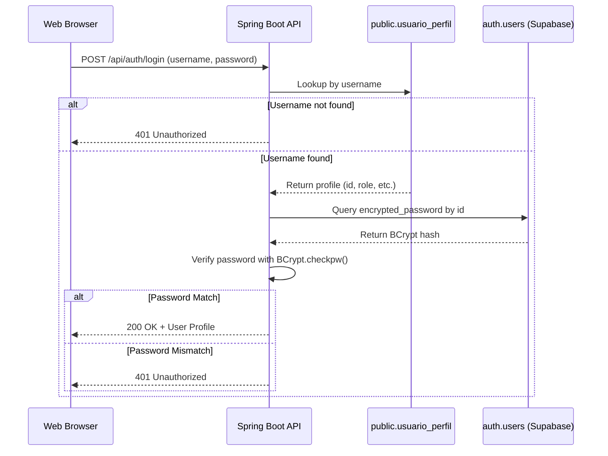

# Security Authentication Upgrade: Supabase Auth Integration

We have upgraded the dashboard authentication to delegating user password management to the native Supabase `auth.users` table using **BCrypt** hashing. User passwords are no longer stored in plain text or kept in the public `usuario_perfil` table.

## Architecture

The following diagram illustrates the upgraded secure authentication architecture:



## Database Tables

### 1. `auth.users` (Managed by Supabase)
Stores the secure credentials.
* **`id`**: Unique user UUID (Primary Key, matching profile id).
* **`email`**: User email address (unique login identifier, formatted as `username@oneprocess.com`).
* **`encrypted_password`**: Password encrypted using BCrypt ($2a$ format).
* **`role`**: Default application role (`authenticated`).
* **`created_at`**: Timestamp.

### 2. `public.usuario_perfil` (Application Profile)
Stores user profiles and roles without sensitive credentials.
* **`id`**: Unique profile UUID (Foreign Key to `auth.users`).
* **`nome`**: First name.
* **`sobrenome`**: Last name.
* **`departamento`**: Department.
* **`username`**: Dashboard login username.
* **`role`**: Access role (`admin` or `client`).

---

## Code Modification Summary

### 1. Maven Dependency ([pom.xml](file:///C:/Users/Felipe/scripts/ecosistema-rpa/web/pom.xml))
Added the standard `jbcrypt` dependency:
```xml
<dependency>
    <groupId>org.mindrot</groupId>
    <artifactId>jbcrypt</artifactId>
    <version>0.4</version>
</dependency>
```

### 2. User Profile Entity ([UsuarioPerfil.java](file:///C:/Users/Felipe/scripts/ecosistema-rpa/web/src/main/java/com/oneprocess/rpa/model/UsuarioPerfil.java))
Removed the `password` field from the JPA entity entirely to ensure it is never written to or read from `public.usuario_perfil`.

### 3. Database Seeding ([DatabaseSeeder.java](file:///C:/Users/Felipe/scripts/ecosistema-rpa/web/src/main/java/com/oneprocess/rpa/config/DatabaseSeeder.java))
* Added a database compatibility fallback checking/creating schema `auth` and table `auth.users` (safely handled via `try-catch` to avoid permission issues when running on the real Supabase PostgreSQL).
* Updated seeding check: if the database is in transition (i.e. profile table populated but `auth.users` is empty), it cleans up and runs a clean seed.
* Encrypts seeded passwords using `BCrypt.hashpw()` and inserts them directly into `auth.users`.

### 4. REST Controllers ([Controllers.java](file:///C:/Users/Felipe/scripts/ecosistema-rpa/web/src/main/java/com/oneprocess/rpa/controller/Controllers.java))
* **`AuthController.login`**: Queries the encrypted password hash from `auth.users` by profile UUID and checks it against the raw request password using `BCrypt.checkpw()`.
* **`ClienteController.create`**: Automatically generates a secure BCrypt hash and inserts the login row into `auth.users` when a client user is created.
* **`ClienteController.delete`**: Automatically purges the login credentials row from `auth.users` when a client is deleted.

---

> [!NOTE]
> All credentials continue to function exactly the same on the frontend, but behind the scenes, passwords are now fully protected and encrypted.
